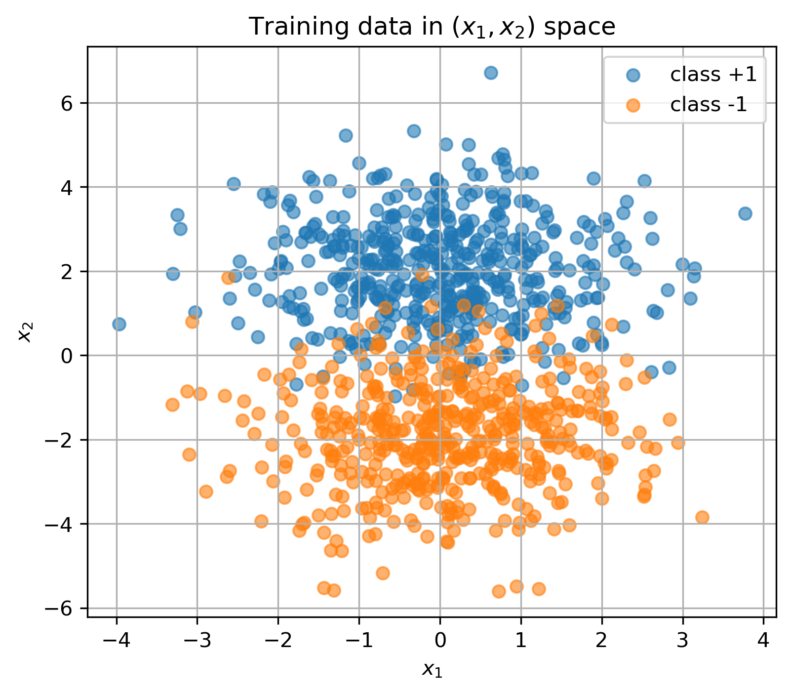
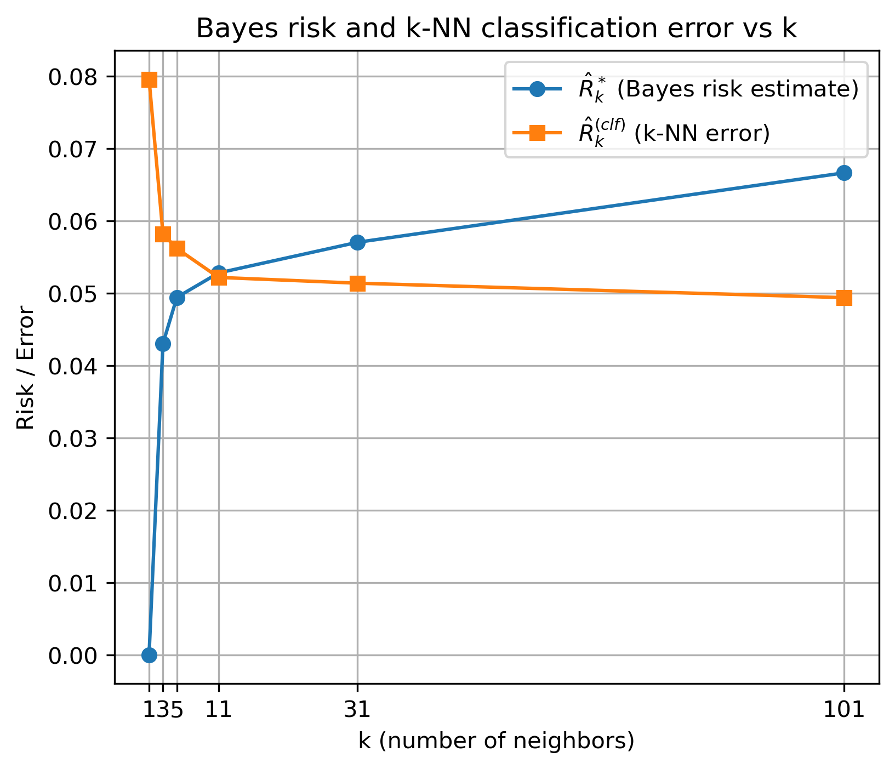
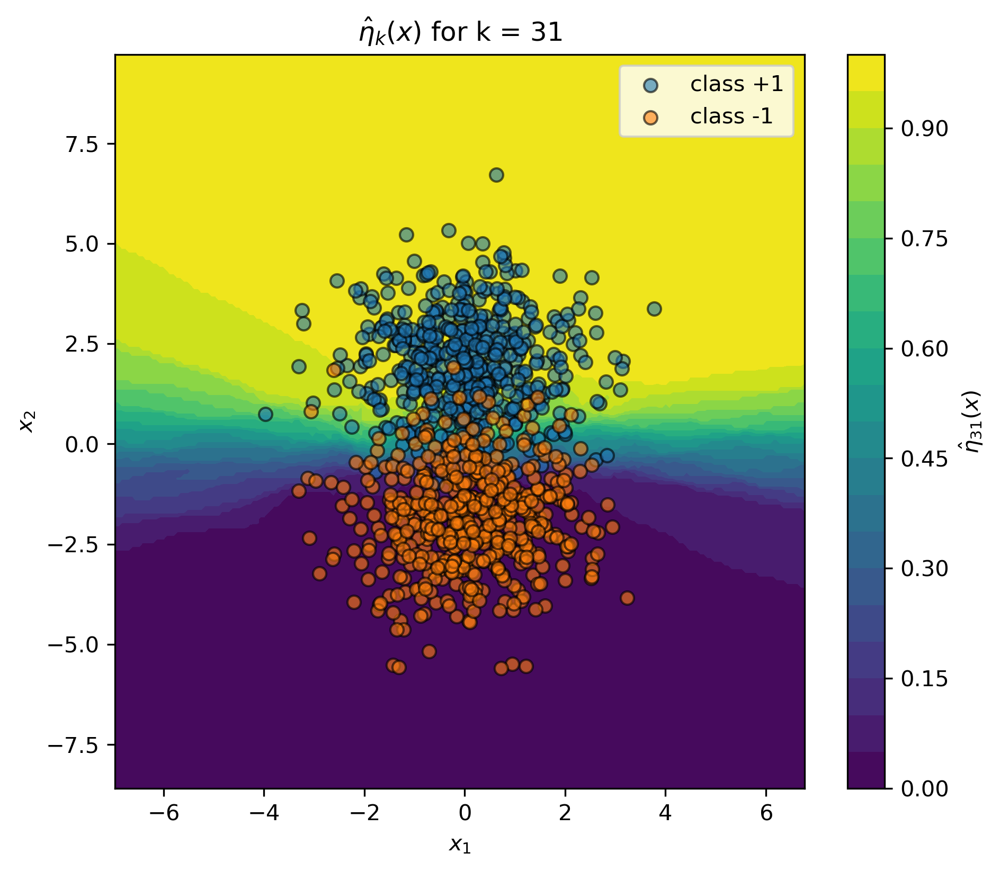

# Bayes Risk Estimation with k-NN

This project implements a numerical estimation of the Bayes risk using k-Nearest Neighbors (k-NN) probability estimates and compares it with the classification error of the k-NN classifier. The assignment follows a classic two-class Gaussian setting where the Bayes classifier is analytically optimal, and the Bayes risk is non-zero due to overlap of class distributions.

---

## 1. Problem Setup

We consider a binary classification problem with two balanced classes generated from Gaussian distributions:

**Class +1:**

$X \sim \mathcal{N}(\mu_{+}, \Sigma)$  
$\mu_{+} = (0, 2)$

**Class –1:**

$X \sim \mathcal{N}(\mu_{-}, \Sigma)$  
$\mu_{-} = (0, -2)$

with shared covariance:

$$
\Sigma =
\begin{bmatrix}
1.5 & 0 \\
0   & 1.5
\end{bmatrix}
$$

---

## 2. Estimating η(x) via k-NN

We estimate the conditional probability

$$
\eta(x) = P(Y = 1 \mid X = x)
$$

using the k-NN empirical estimator:

$$
\hat{\eta}_k(x) = \frac{1}{k} 
\sum_{i \in N_k(x)} \mathbf{1}[Y_i = 1],
$$

where $N_k(x)$ denotes the indices of the $k$ nearest neighbors of $x$ in the training set.

This estimator becomes smoother as $k$ increases, reducing variance but increasing bias.

---

## 3. Estimating the Bayes Risk

The empirical Bayes risk is estimated on the test set using the k-NN probability estimates:

$$
\hat{R}^*_k =
\frac{1}{m_{\text{test}}}
\sum_{j=1}^{m_{\text{test}}}
\min \left( \hat{\eta}_k(x_j),\, 1 - \hat{\eta}_k(x_j) \right)
$$

This quantity represents the **irreducible classification error** —  
the minimum achievable error for this generative model, due to the overlap of class-conditional distributions.

As $k$ increases, the estimator becomes smoother and converges toward the true Bayes risk.

---

## 4. k-NN Classifier and Test Error

The classifier induced by the estimated probabilities is:

$$
h_k(x) =
\begin{cases}
+1, & \hat{\eta}_k(x) \ge 0.5, \\
-1, & \hat{\eta}_k(x) < 0.5.
\end{cases}
$$

The empirical classification error is computed as:

$$
\hat{R}_k^{(\text{clf})} =
\frac{1}{m_{\text{test}}}
\sum_{j=1}^{m_{\text{test}}}
\mathbf{1}[\, h_k(x_j) \ne y_j \,].
$$

Small values of $k$ lead to high variance and overfitting, while large $k$ increase bias but reduce noise in the estimates.  
This behavior is clearly reflected in the test error curve.

---

## 5. Results

### Training Data Visualization

The dataset forms two Gaussian clusters centered at $(0, 2)$ and $(0, -2)$.  
Overlap between their tails around $x_2 \approx 0$ produces a non-zero Bayes risk.

  

### Bayes Risk and k-NN Error

  

The curves exhibit the expected bias–variance trade-off:

- **Small k (k = 1):** high variance → overfitting → large classification error  
- **Moderate k (5–11):** optimal region  
- **Large k (31, 101):** smoother predictions → slightly higher bias

The estimated Bayes risk is always lower than the classifier error, as required by theory.

### Heatmap of $\hat{\eta}(x)$

  

For $k = 31$, we plot a probability heatmap showing:

- regions strongly associated with class +1,  
- regions strongly associated with class −1,  
- a smooth transition zone where $\hat{\eta}(x) \approx 0.5$.

This transition region corresponds to the Bayes decision boundary and aligns with the area where the two Gaussian distributions overlap.

---

## 6. Key Takeaways

- k-NN provides a simple and effective estimator of the conditional probability $\eta(x)$.
- The Bayes risk can be approximated empirically using k-NN probability estimates.
- The classifier error curve and the Bayes risk curve clearly illustrate the classic **bias–variance trade-off**.
- The estimated Bayes risk remains strictly below the classifier error, confirming the optimality of the Bayes classifier.
- Larger values of $k$ yield smoother probability estimates, while smaller values of $k$ result in higher variance and overfitting.

---

